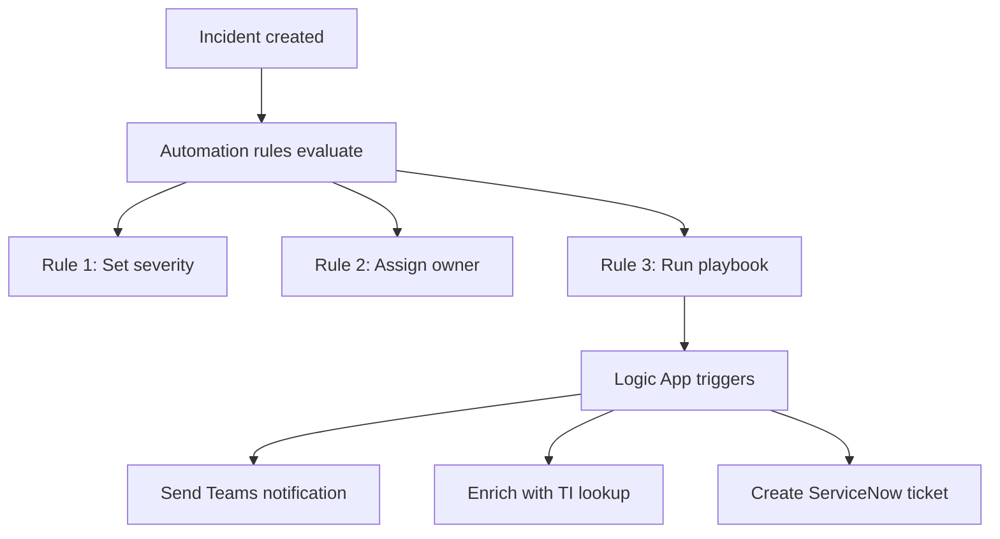

# SC-200 Implementation Guide

## Automation Rules & Playbooks

### What
Automation rules handle incident triage automatically. Playbooks are Logic Apps that run complex response actions. Automation rules execute first and can trigger playbooks.

### Steps – Automation Rule

1. **Navigate** – Sentinel → Automation → Create → Automation rule
2. **Set trigger** – When incident is created or updated
3. **Add conditions** – Filter by analytic rule name, severity, entities, tactics
4. **Define actions** – Change status, assign owner, change severity, add tags, run playbook
5. **Set order** – Rules run in order number (lowest first)
6. **Set expiration** – Optionally set an end date
7. **Enable** – Save and activate

### Steps – Playbook (Logic App)

1. **Navigate** – Sentinel → Automation → Create → Playbook with incident trigger
2. **Choose trigger** – "When a Microsoft Sentinel incident creation rule was triggered"
3. **Add actions** – Send email, post to Teams, isolate device, block IP, create ticket
4. **Authenticate connectors** – Each action needs an authenticated connection (managed identity recommended)
5. **Test** – Run a test incident through the playbook
6. **Attach to automation rule** – Link the playbook from an automation rule's "Run playbook" action

### Flow

### Key Exam Points

- Automation rules run **before** playbooks – they are the trigger mechanism
- Automation rules can run **without** playbooks (just triage actions)
- Playbooks require **Logic App Contributor** role + **Sentinel Responder** (minimum)
- Use **managed identity** for playbook authentication (not user credentials)
- Automation rules have an **order** – lower number runs first
- A single incident can trigger **multiple** automation rules
