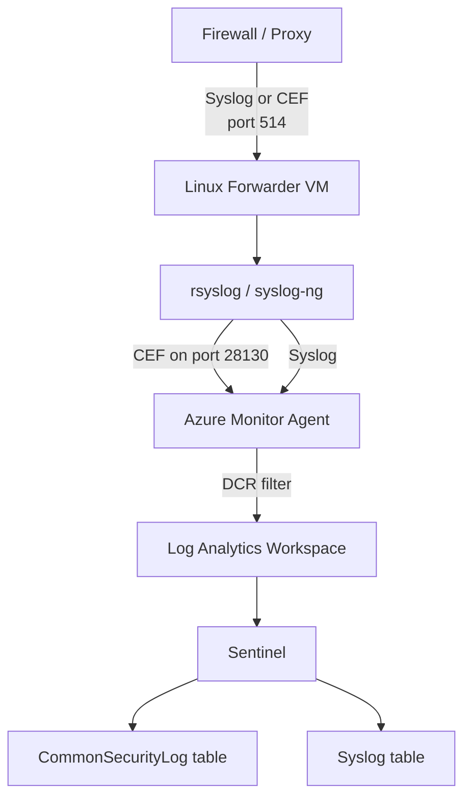

# SC-200 Implementation Guide

## Implementing CEF / Syslog Collection

### What
Collect Common Event Format (CEF) and Syslog data from firewalls, proxies, and Linux appliances into Sentinel using Azure Monitor Agent (AMA) and Data Collection Rules (DCR).

### Steps

1. **Deploy a Linux forwarder VM** – Ubuntu/RHEL VM in Azure (or on-prem via Arc) to receive logs
2. **Install AMA** – Deploy Azure Monitor Agent on the forwarder via Sentinel data connector page or Azure Policy
3. **Create DCR** – Data Collection Rule defines which facilities/severities to collect and the destination workspace
4. **Configure source appliances** – Point firewalls/proxies to send Syslog/CEF to the forwarder VM (UDP/TCP 514)
5. **CEF vs Syslog routing** – CEF arrives on port 514 → rsyslog parses the CEF header → sends to AMA on port 28130
6. **Validate data flow** – Check the `Syslog` and `CommonSecurityLog` tables in Log Analytics
7. **Fine-tune DCR** – Filter by facility (auth, daemon, etc.) and severity to reduce noise and cost

### Architecture



### Example KQL – Verify CEF Ingestion

```kql
CommonSecurityLog
| where TimeGenerated > ago(1h)
| summarize Count = count() by DeviceVendor, DeviceProduct
| order by Count desc
```

### Example KQL – Syslog Auth Failures

```kql
Syslog
| where Facility == "auth" and SeverityLevel == "err"
| where TimeGenerated > ago(1d)
| summarize Count = count() by HostName, ProcessName
| order by Count desc
```

### Key Exam Points

- **CEF** logs go to `CommonSecurityLog` table; **Syslog** logs go to `Syslog` table
- CEF is a **structured format on top of Syslog** – same transport, richer parsing
- The Linux forwarder needs **rsyslog** (or syslog-ng) to route CEF to AMA
- **AMA + DCR** is the current method (legacy Log Analytics agent is deprecated)
- DCR lets you **filter by facility and severity** before ingestion to control costs
- Forwarder VM can be in Azure, on-prem (via Arc), or another cloud
- For high-volume environments, use a **dedicated forwarder** (not a shared VM)
- **Port 514** = source appliance → forwarder; **port 28130** = rsyslog → AMA (CEF only)
