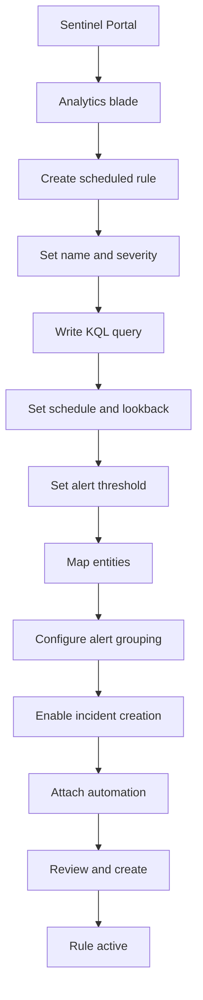

# SC-200 Implementation Guide

## Creating a Custom Analytics Rule

### What
Scheduled analytic rules run KQL queries on a timer to detect threats and automatically create incidents in Sentinel.

### Steps

1. **Navigate** – Sentinel → Analytics → Create → Scheduled query rule
2. **General tab** – Set name, description, severity, MITRE ATT&CK tactics
3. **Rule logic tab** – Write the KQL detection query
4. **Set schedule** – Query frequency (e.g. every 5 min) and lookup period (e.g. last 5 min)
5. **Alert threshold** – Trigger when query returns more than X results (default: > 0)
6. **Entity mapping** – Map result columns to entity types (Account, Host, IP, URL)
7. **Custom details** – Surface extra fields in the alert for analyst visibility
8. **Alert grouping** – Group related alerts into a single incident (by entity or time window)
9. **Incident settings** – Enable incident creation from alerts
10. **Automated response** – Attach automation rules or playbooks
11. **Review + Create** – Validate and enable the rule

### Flow



### Example KQL – Brute Force Detection

```kql
SigninLogs
| where ResultType == "50126"
| summarize FailCount = count() by UserPrincipalName, IPAddress, bin(TimeGenerated, 5m)
| where FailCount > 10
```

### Key Exam Points

- **Frequency** = how often the rule runs; **Lookup period** = how far back it queries
- Lookup period must be **≥ frequency** to avoid gaps (overlap is OK)
- **Entity mapping** is critical – enables investigation graph and UEBA correlation
- **Alert grouping** reduces noise by merging related alerts into one incident
- **NRT rules** are a separate type – run every 1 min, no custom schedule
- Rules can be created from **rule templates** (Content hub) or from scratch
- **Simulated results** button lets you test the query before enabling
