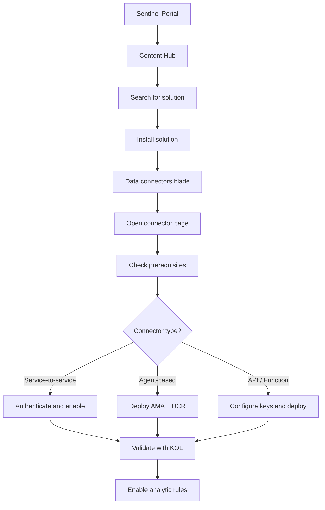

# SC-200 Implementation Guide

## Adding a Data Connector

### What
Data connectors ingest logs and alerts from Microsoft services, third-party products, and custom sources into Sentinel's Log Analytics workspace.

### Steps

1. **Navigate** – Sentinel → Content hub (for solutions) or Data connectors blade
2. **Find connector** – Search by product name (e.g. Microsoft 365, AWS, Palo Alto)
3. **Install solution** – If from Content hub, install the solution package first (includes connector + rules + workbooks)
4. **Open connector page** – Click the connector → "Open connector page"
5. **Review prerequisites** – Check required permissions, licences, and workspace settings
6. **Configure** – Follow the connector-specific steps:
   - **Service-to-service** – Authenticate and select tables/logs to enable
   - **Agent-based** – Deploy AMA + DCR to source machines
   - **API/Function-based** – Provide API keys, endpoints, deploy Function App
7. **Validate ingestion** – Run a KQL query against the target table to confirm data flows
8. **Enable analytic rules** – Activate the rule templates that came with the solution

### Flow



### Example KQL – Verify Data Ingestion

```kql
CommonSecurityLog
| where TimeGenerated > ago(1h)
| summarize EventCount = count() by DeviceVendor
| order by EventCount desc
```

### Key Exam Points

- **Content hub solutions** bundle connectors, analytic rules, workbooks, and hunting queries together
- **Service-to-service** connectors (M365, Azure AD) are the simplest – no agent needed
- **Agent-based** connectors use **AMA + Data Collection Rules** (legacy: Log Analytics agent – deprecated)
- Connector page shows a **status indicator** – green = receiving data
- Always **validate ingestion** with a KQL query before relying on detections
- Some connectors require specific roles (e.g. Global Admin for M365 connector)
