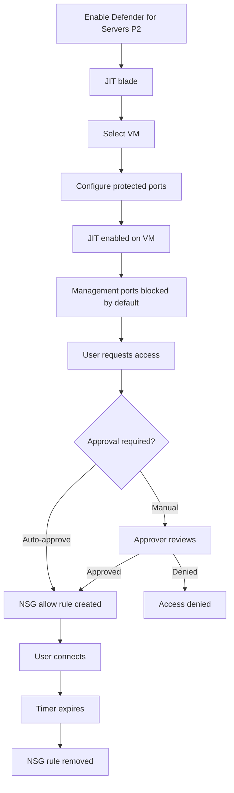

# SC-200 Implementation Guide

## Defender for Cloud – JIT VM Access

### What
Just-In-Time VM access locks down inbound management ports (RDP, SSH) and opens them only on approved request for a limited time window, reducing attack surface.

### Steps

1. **Prerequisites** – Enable Defender for Servers Plan 2 on the subscription
2. **Navigate** – Defender for Cloud → Workload protections → Just-in-time VM access
3. **Enable JIT on VM** – Select a VM → "Enable JIT on VM" (or configure from VM blade → Networking)
4. **Configure ports** – Define which ports to protect (default: 3389/RDP, 22/SSH), allowed source IPs, and max request duration
5. **Request access** – User clicks "Request access" → selects ports, source IP, and duration
6. **Approval** – Access is auto-approved or requires manual approval (configurable)
7. **NSG rule created** – Temporary allow rule added to the VM's NSG for the duration
8. **Access expires** – Rule is automatically removed when time expires

### Flow

### Key Exam Points

- Requires **Defender for Servers Plan 2** (P1 has limited JIT support)
- Works by creating **temporary NSG rules** – not a VPN or proxy
- Default max duration is **3 hours** per request
- Ports are **closed by default** – deny-all inbound on managed ports
- JIT can be requested from Azure portal, Defender for Cloud, or via **API/PowerShell**
- **RBAC** – users need at minimum the **Reader** role + a custom role with `Microsoft.Security/locations/jitNetworkAccessPolicies/*/read` and `initiate/action`
- JIT logs appear in the **Activity log** and can be sent to Sentinel
- Reduces exposure to **brute force and port scanning** attacks
