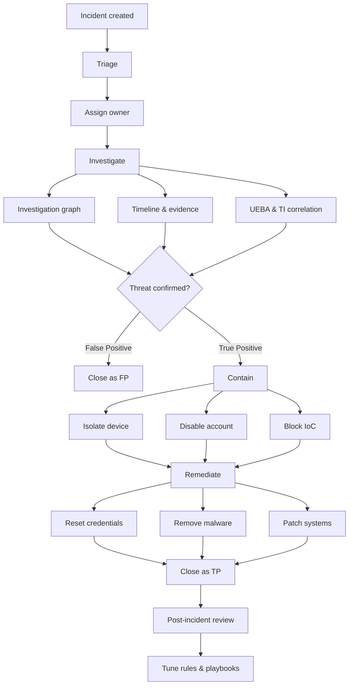

# SC-200 Implementation Guide

## Incident Response Workflow

### What
End-to-end process for handling security incidents in Microsoft Sentinel and Defender XDR – from initial triage to post-incident review.

### Steps

1. **Triage** – Review the incident queue; assess severity, status, and scope
2. **Assign** – Set owner, status to "Active", add tags for categorisation
3. **Investigate** – Open the investigation graph; review entities (users, hosts, IPs), timeline, and evidence
4. **Correlate** – Check related alerts, UEBA anomalies, and TI matches
5. **Contain** – Take immediate actions: isolate device, disable account, block IoC
6. **Remediate** – Remove malware, reset credentials, patch vulnerabilities, revoke sessions
7. **Document** – Add comments to the incident, update bookmarks with findings
8. **Close** – Set classification (True Positive, False Positive, Benign) and close
9. **Post-incident** – Review lessons learned, tune analytic rules, update playbooks

### Flow

### Incident Classification Options

| Classification | When to use |
|---------------|------------|
| True Positive – Suspicious activity | Confirmed threat, malicious activity |
| Benign Positive – Suspicious but expected | Real activity but not a threat (e.g. pen test) |
| False Positive – Incorrect | Alert triggered on non-malicious activity |
| Undetermined | Insufficient data to classify |

### Key Exam Points

- Incidents are in **Sentinel** and/or **Defender XDR** portal (unified queue)
- **Investigation graph** shows entity relationships and activity timeline
- Always **classify** incidents before closing – this improves ML and analytics
- **Automation rules** can handle triage steps automatically (assign, tag, change severity)
- **Playbooks** can automate containment (isolate device, block IP via Logic App)
- **Sentinel Responder** role = manage incidents; **Sentinel Reader** = view only
- Evidence from hunting can be added to incidents via **bookmarks**
