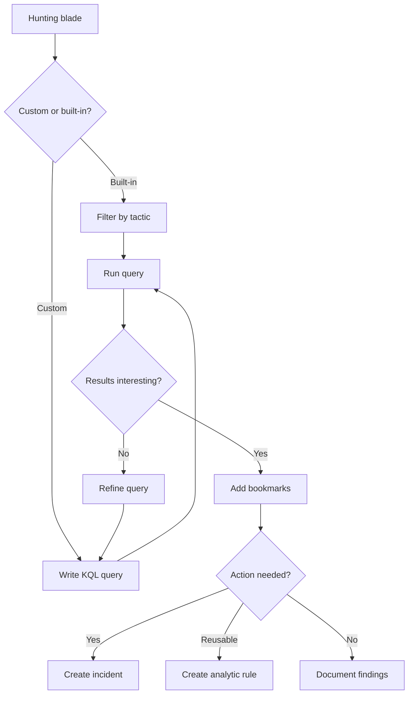

# SC-200 Implementation Guide

## KQL Hunting Queries

### What
Proactive threat hunting using KQL queries in Sentinel to find threats that analytic rules didn't catch.

### Steps

1. **Navigate** – Sentinel → Hunting
2. **Browse built-in queries** – Filter by MITRE tactic, data source, or technique
3. **Create custom query** – Click "New query"
4. **Write KQL** – Target specific tables (e.g. SigninLogs, DeviceProcessEvents)
5. **Map entities** – Define entity mappings so results link to investigation graph
6. **Assign MITRE tactics** – Tag with relevant ATT&CK techniques
7. **Run query** – Execute and review results
8. **Bookmark results** – Select interesting rows → "Add bookmark" to save as evidence
9. **Promote to incident** – Select bookmarks → "Create incident" for SOC follow-up
10. **Promote to analytic rule** – Convert a proven hunting query into a scheduled rule

### Flow



### Example KQL – Rare Process on Endpoints

```kql
DeviceProcessEvents
| where TimeGenerated > ago(7d)
| summarize ExecutionCount = count() by FileName
| where ExecutionCount == 1
| join kind=inner (
    DeviceProcessEvents
    | where TimeGenerated > ago(7d)
) on FileName
| project TimeGenerated, DeviceName, FileName, ProcessCommandLine
```

### Key Exam Points

- Hunting is **proactive** – you look for threats, not wait for alerts
- **Bookmarks** save evidence from hunting results for later investigation
- Bookmarks can be **promoted to incidents**
- Proven queries should become **analytic rules** for ongoing detection
- **Livestream** is for real-time testing; hunting queries are run on-demand
- Built-in queries are tagged with **MITRE ATT&CK** tactics and techniques
