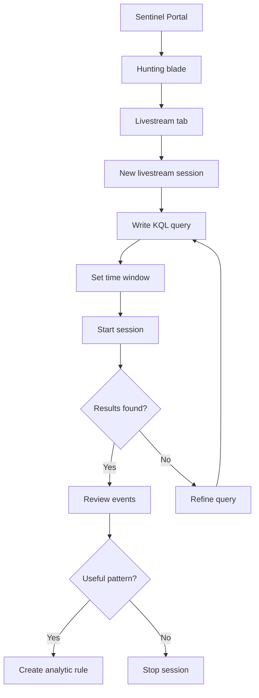

# SC-200 Implementation Guide

## Sentinel Livestream

### What
Real-time hunting session that runs a KQL query continuously and alerts you when results appear – test queries before promoting to analytic rules.

### Steps

1. **Navigate** – Sentinel → Hunting
2. **New livestream** – Click "Livestream" tab → "New livestream session"
3. **Write KQL** – Enter a hunting query that returns events of interest
4. **Set time window** – Choose how far back to look on each run cycle
5. **Run** – Start the session; results stream in near real-time
6. **Monitor** – Review matching events as they appear in the results pane
7. **Promote or discard** – If the query proves useful, create an analytic rule from it; otherwise stop the session

### Flow



### Example KQL – Suspicious PowerShell Execution

```kql
DeviceProcessEvents
| where FileName == "powershell.exe"
| where ProcessCommandLine has_any ("-enc", "-encoded", "bypass", "hidden")
| project TimeGenerated, DeviceName, AccountName, ProcessCommandLine
```

### Key Exam Points

- Livestream is for **testing hunting queries in real time**
- Results appear as events match – no need to manually re-run
- Livestream is **not** an analytic rule – it does not create incidents automatically
- Useful queries should be **promoted to analytic rules** for ongoing detection
- Sessions are temporary – they stop when you close them
