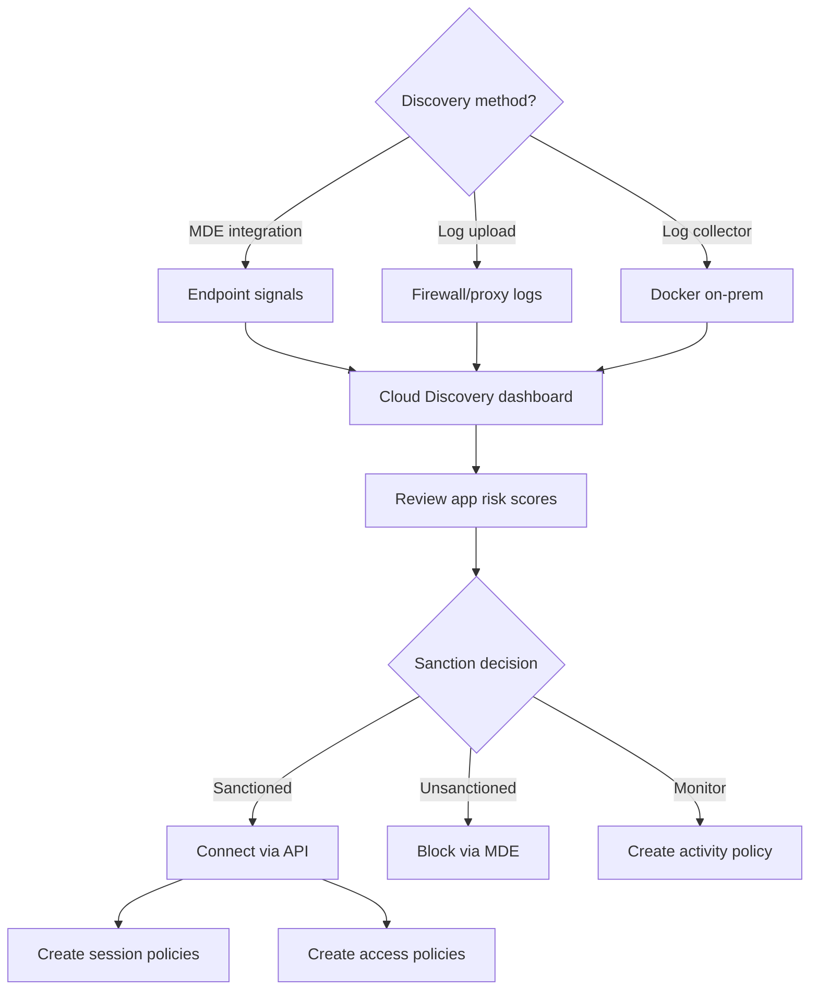

# SC-200 Implementation Guide

## MDA – Shadow IT Discovery & App Control

### What
Use Microsoft Defender for Cloud Apps (MDA) to discover unsanctioned SaaS apps, assess risk, and control access with session and access policies.

### Steps – Shadow IT Discovery

1. **Navigate** – Defender portal → Cloud apps → Cloud discovery
2. **Choose discovery method:**
   - **MDE integration** – Automatic; if MDE is deployed, it reports cloud app traffic directly
   - **Log upload** – Upload firewall/proxy logs manually (snapshot report)
   - **Log collector** – Deploy Docker container on-prem for continuous log upload
3. **Review discovered apps** – Dashboard shows all SaaS apps in use with risk scores
4. **Sanction or unsanction** – Mark apps as Sanctioned, Unsanctioned, or Monitored
5. **Block unsanctioned apps** – MDE integration can block access to unsanctioned apps on endpoints

### Steps – App Connectors & Policies

1. **Connect apps** – Cloud apps → Connected apps → Add API connector (e.g. Box, Salesforce, AWS)
2. **Create policies:**
   - **Access policy** – Block or monitor sign-in to app based on conditions
   - **Session policy** – Control actions within the app (block download, apply label, monitor)
   - **Activity policy** – Alert on specific user activities (mass download, shared externally)
3. **Conditional Access App Control** – Route app traffic through MDA reverse proxy via Entra ID CA policy

### Flow

### Key Exam Points

- **MDE integration** is the easiest discovery method – no log upload needed
- **Log collector** = Docker container deployed on-prem for continuous discovery
- **App connectors** use APIs – give MDA visibility into files, activities, accounts
- **Conditional Access App Control** uses a **reverse proxy** – requires Entra ID CA policy
- **Session policies** can block downloads, apply sensitivity labels, or monitor in real time
- **OAuth app governance** detects overprivileged or malicious third-party OAuth apps
- MDA provides a **risk score** (1-10) for each discovered app
- **Unsanctioned apps** can be blocked at the endpoint if MDE integration is enabled
