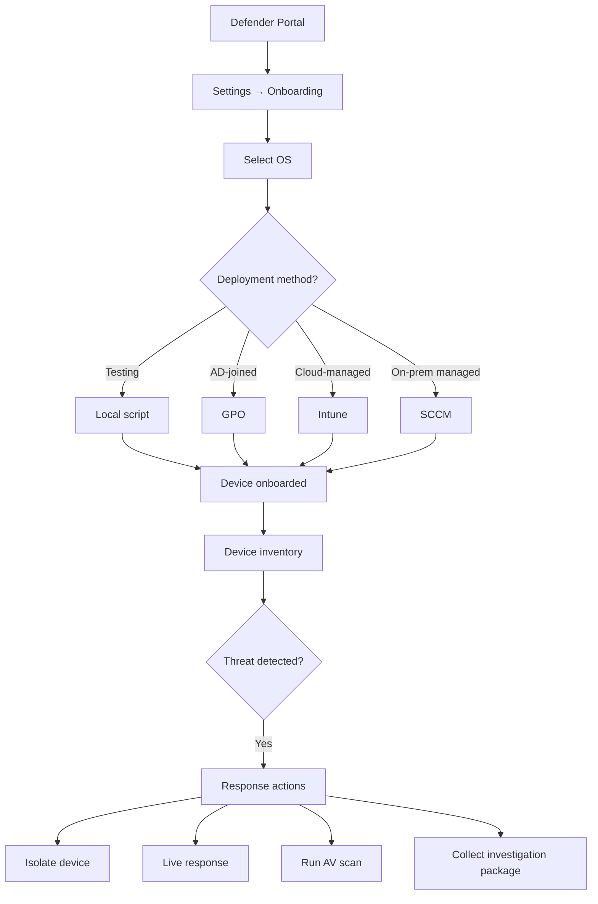

# SC-200 Implementation Guide

## MDE – Onboarding & Response Actions

### What
Onboard devices to Microsoft Defender for Endpoint and use response actions to investigate and contain threats.

### Steps – Onboarding

1. **Navigate** – Microsoft Defender portal → Settings → Endpoints → Onboarding
2. **Select OS** – Windows 10/11, Windows Server, macOS, Linux, iOS, Android
3. **Choose method:**
   - **Local script** – download and run on individual machines (testing)
   - **Group Policy (GPO)** – deploy onboarding package via AD GPO
   - **Intune / MEM** – push configuration profile to managed devices
   - **SCCM / ConfigMgr** – deploy via System Center
4. **Verify onboarding** – Device appears in device inventory within minutes
5. **Run detection test** – Execute the EICAR-like test command from the onboarding page

### Steps – Response Actions

1. **Isolate device** – Cut network (keeps Defender cloud connection)
2. **Restrict app execution** – Only allow Microsoft-signed binaries
3. **Run AV scan** – Trigger full or quick scan remotely
4. **Collect investigation package** – Download forensic data from device
5. **Live response** – Open remote shell session for manual investigation
6. **Initiate automated investigation** – Let AIR analyse and remediate

### Flow

### Key Exam Points

- **Onboarding ≠ installing AV** – MDE P2 adds EDR on top of built-in Defender AV
- **Device isolation** keeps the Defender cloud connection alive (for commands)
- **Live response** requires enabling in advanced settings + correct RBAC role
- **AIR** (Automated Investigation & Response) can auto-remediate or require approval
- **ASR rules** are configured separately (attack surface reduction – block macros, scripts)
- **Indicators** (IoCs) let you allow/block specific files, IPs, URLs, certificates
- **Device groups** scope RBAC permissions and automation levels
- iOS/Android onboarding goes through **Intune app deployment**
