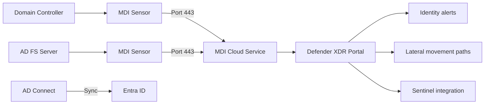

# SC-200 Implementation Guide

## MDI – Sensor Deployment

### What
Deploy Microsoft Defender for Identity sensors on domain controllers to detect identity-based attacks like lateral movement, pass-the-hash, and credential theft in on-prem Active Directory.

### Steps

1. **Prerequisites** – Ensure AD Connect syncs on-prem AD to Entra ID
2. **Navigate** – Defender portal → Settings → Identities → Sensors
3. **Download sensor** – Download the sensor installer package + copy the access key
4. **Install on DC** – Run the installer on each domain controller (or AD FS server)
5. **Configure service account** – Provide a Directory Services account (gMSA recommended) for querying AD
6. **Verify connectivity** – Sensor connects to MDI cloud service on port 443
7. **Validate** – Check sensor health status in the portal (green = healthy)
8. **Configure alerts** – Review and tune detection policies (honeytoken, lateral movement paths)

### Architecture

### What MDI Detects

| Detection | Example |
|-----------|---------|
| Credential theft | Pass-the-hash, pass-the-ticket, Kerberoasting |
| Lateral movement | Overpass-the-hash, remote code execution |
| Reconnaissance | Account enumeration, network mapping, SamR queries |
| Domain dominance | DCSync, DCShadow, Golden Ticket |
| Compromised accounts | Brute force, abnormal authentications |

### Key Exam Points

- Sensor is installed **directly on domain controllers** (not a separate server)
- **AD FS servers** also need sensors for federated auth detection
- Requires **AD Connect** to Entra ID for full coverage
- **gMSA** (group Managed Service Account) is the recommended service account type
- Sensor captures **network traffic** and **Windows events** from the DC
- MDI does **not** require an agent on endpoints – it monitors AD traffic
- **Honeytoken accounts** – dummy accounts that trigger alerts when used
- **Lateral movement paths** show how an attacker could reach sensitive accounts
