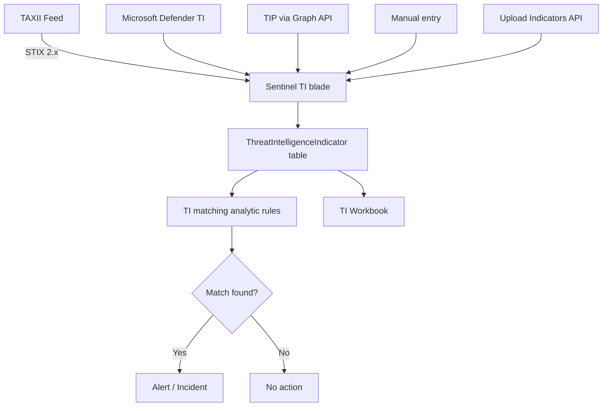

# SC-200 Implementation Guide

## Threat Intelligence – Feeding Sentinel

### What
Import Indicators of Compromise (IoCs) into Sentinel to automatically match against log data and generate alerts when threats are detected in your environment.

### Steps

1. **Navigate** – Sentinel → Threat intelligence blade
2. **Choose an ingestion method:**
   - **Manual** – Add individual indicators (IP, domain, URL, hash) directly in the portal
   - **TAXII connector** – Connect to a STIX/TAXII 2.x feed (e.g. MITRE ATT&CK, Anomali, AlienVault OTX)
   - **Defender TI connector** – Ingest Microsoft's own threat intelligence
   - **TI Platforms connector** – Forward from a TIP (Threat Intelligence Platform) via Graph Security API
   - **TI Upload API** – Bulk upload indicators via the Upload Indicators API
3. **Configure connector** – Provide TAXII server URL, collection ID, credentials (or API keys for TIP)
4. **Set indicator properties** – Threat type, confidence, validity period, kill chain phase
5. **Validate ingestion** – Check the `ThreatIntelligenceIndicator` table in Log Analytics
6. **Enable TI matching analytics** – Activate built-in analytic rules that correlate IoCs against log tables
7. **Use TI workbook** – Monitor indicator volume, types, sources, and match rates

### Architecture



### Built-in TI Matching Rules

| Rule | Matches IoCs Against |
|------|---------------------|
| TI map IP entity | Network logs, sign-in logs, firewall logs |
| TI map Domain entity | DNS, proxy, web logs |
| TI map URL entity | Proxy, Office 365, device network events |
| TI map File Hash entity | MDE file events, CommonSecurityLog |
| TI map Email entity | Exchange / Office 365 logs |

### Example KQL – View Active Indicators

```kql
ThreatIntelligenceIndicator
| where Active == true
| where ExpirationDateTime > now()
| summarize Count = count() by ThreatType, IndicatorType
| order by Count desc
```

### Example KQL – Check for IP Matches

```kql
ThreatIntelligenceIndicator
| where Active == true and IndicatorType == "ipv4-addr"
| join kind=inner (
    SigninLogs
    | where TimeGenerated > ago(1d)
) on $left.NetworkIP == $right.IPAddress
| project TimeGenerated, UserPrincipalName, IPAddress, ThreatType, Confidence
```

### Key Exam Points

- **TAXII** = transport protocol; **STIX** = indicator format – they work together
- **TI matching rules** must be **enabled manually** – they are not on by default
- Indicators have a **validity period** – expired indicators stop matching
- **Confidence score** helps prioritise – high confidence IoCs should trigger higher severity
- The `ThreatIntelligenceIndicator` table stores all imported indicators
- **Defender TI connector** provides Microsoft-curated intelligence (requires licence)
- **TI Upload API** replaced the older tiIndicators Graph API for bulk ingestion
- Indicators can be tagged for **kill chain phase** (reconnaissance, delivery, C2, etc.)
