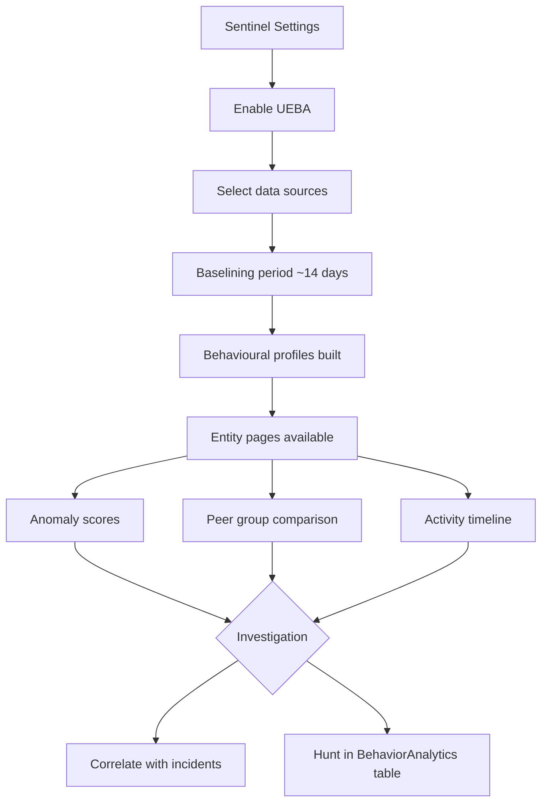

# SC-200 Implementation Guide

## UEBA – User & Entity Behavior Analytics

### What
UEBA builds behavioural baselines for users, hosts, and IP addresses, then detects anomalies that may indicate compromised accounts or insider threats.

### Steps

1. **Navigate** – Sentinel → Settings → UEBA (under Entity behavior configuration)
2. **Enable UEBA** – Toggle on
3. **Select data sources** – Choose which connectors feed UEBA (Azure AD, Audit Logs, Security Events)
4. **Wait for baselining** – UEBA needs ~14 days to build behavioural profiles
5. **Review entity pages** – Sentinel → Entity behavior → search for a user/host/IP
6. **Check anomalies** – Entity page shows anomaly scores, peer group comparisons, and activity timeline
7. **Use in hunting** – Query the `BehaviorAnalytics` table in KQL for anomaly-enriched events
8. **Correlate with incidents** – Entity pages link to related incidents and alerts

### Flow



### Example KQL – High-Risk Anomalies

```kql
BehaviorAnalytics
| where TimeGenerated > ago(7d)
| where ActivityInsights has "True"
| where InvestigationPriority > 5
| project TimeGenerated, UserPrincipalName, ActionType, InvestigationPriority, ActivityInsights
| order by InvestigationPriority desc
```

### Key Exam Points

- UEBA must be **explicitly enabled** – it is off by default
- Requires **~14 days** to build accurate behavioural baselines
- Detects: impossible travel, anomalous logins, unusual resource access, first-time activity
- Data goes to the **BehaviorAnalytics** table in Log Analytics
- **Entity pages** aggregate all signals for a user/host/IP in one view
- **InvestigationPriority** score ranks how suspicious an entity is (0–10)
- Feeds into the **investigation graph** on incidents
- Works best combined with **Azure AD** and **Security Events** data sources
