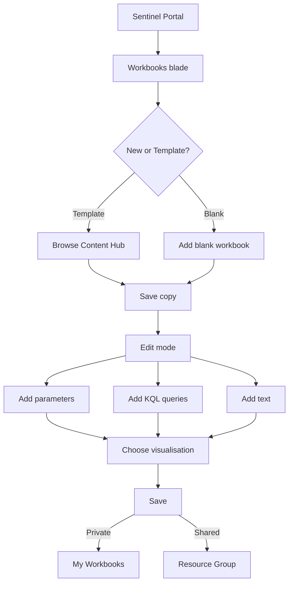

# SC-200 Implementation Guide

## Sentinel Workbooks

### What
Azure Monitor Workbooks inside Sentinel – interactive dashboards for visualising security data.

### Steps

1. **Navigate** – Sentinel → Workbooks → Templates or My workbooks
2. **Choose template or blank** – Content hub has prebuilt templates (e.g. Azure AD Sign-ins, Incident Overview)
3. **Edit** – Click "View template" → "Save" to clone, then "Edit" to customise
4. **Add elements** – Query (KQL), parameters (dropdowns/time pickers), text, metrics, charts
5. **Write KQL** – Each visualisation tile runs a KQL query against Log Analytics
6. **Set visualisation type** – Table, bar chart, time chart, pie chart, map, tiles, etc.
7. **Add parameters** – Time range picker, subscription filter, or custom dropdown to make it interactive
8. **Save** – Save to "My workbooks" (private) or a shared resource group
9. **Pin to dashboard** – Optionally pin individual tiles to an Azure dashboard

### Flow



### Example KQL – Incidents by Severity (last 7 days)

```kql
SecurityIncident
| where TimeGenerated > ago(7d)
| summarize Count = count() by Severity
| order by Count desc
| render barchart
```

### Key Exam Points

- Workbooks are for **monitoring & reporting** (not investigation – that's Notebooks)
- Templates from **Content hub** are read-only until saved as a copy
- Workbooks use **KQL** against the Log Analytics workspace
- **Parameters** make workbooks interactive (time range, entity filters)
- Requires **Workbook Contributor** or **Sentinel Contributor** role to save shared workbooks
