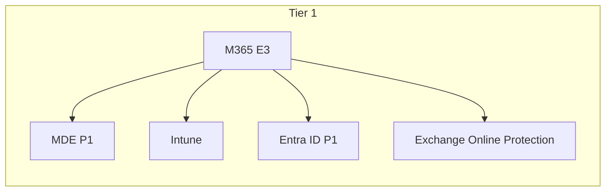
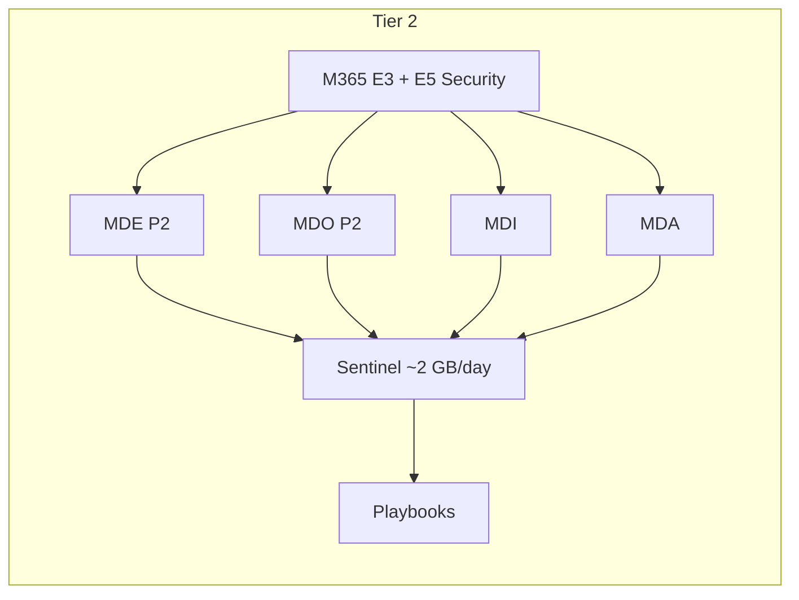
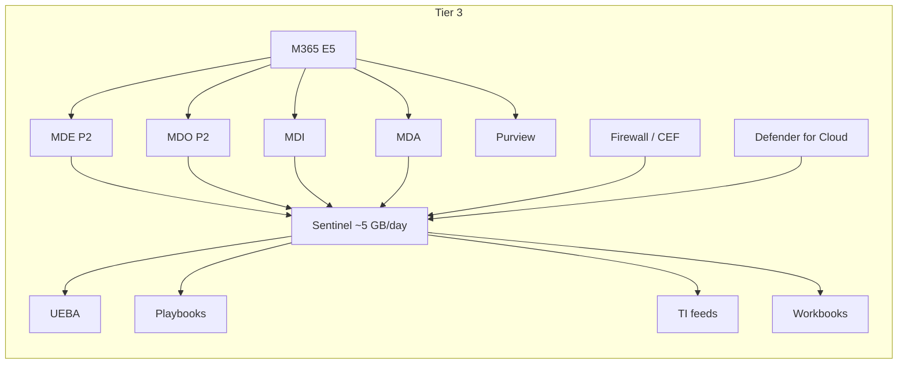

# SC-200 Cost Estimation Guide

## Company Profile

| Parameter | Value |
|-----------|-------|
| Tenants | 2 |
| Users | 50 |
| Devices | 70 (50 Windows + 20 iOS) |

> **Disclaimer:** Prices are approximate monthly estimates based on public Microsoft list pricing. Actual costs vary by region, EA/CSP agreements, and promotions. Always verify with the [Azure pricing calculator](https://azure.microsoft.com/pricing/calculator/) and your Microsoft rep.

---

## Tier 1 – Bare Minimum

Basic endpoint protection and identity security. No SIEM, no advanced threat detection.

| Component | What You Get | Per Unit | Monthly Cost |
|-----------|-------------|----------|-------------|
| M365 E3 (50 users) | MDE P1, Entra ID P1, basic Intune, Exchange Online | ~$36/user | $1,800 |
| | | **Total** | **~$1,800/mo** |

### Included at This Tier

- Defender for Endpoint **P1** – basic antivirus, ASR rules, device control
- Entra ID **P1** – Conditional Access, MFA
- Intune – device management for Windows & iOS
- Exchange Online Protection – basic email filtering

### Not Included

- No SIEM/SOAR (Sentinel)
- No advanced EDR (P2 hunting, AIR, live response)
- No Defender for Office 365 (Safe Links/Attachments)
- No Defender for Identity
- No Cloud App Security (MDA)
- No Purview advanced features

---

## Tier 2 – Enhanced Security

Adds advanced threat detection across endpoints, email, identity, and cloud apps. Light Sentinel for alerting.

| Component | What You Get | Per Unit | Monthly Cost |
|-----------|-------------|----------|-------------|
| M365 E3 (50 users) | Base platform | ~$36/user | $1,800 |
| M365 E5 Security add-on (50 users) | MDE P2, MDO P2, MDI, MDA | ~$14.50/user | $725 |
| Sentinel – Pay-as-you-go (~2 GB/day) | SIEM for Defender alerts + Entra logs | ~$2.76/GB | ~$170 |
| Sentinel playbooks (2 Logic Apps) | Basic automation (email notify, Teams alert) | ~$0.20/run | ~$20 |
| | | **Total** | **~$2,715/mo** |

### Included at This Tier

- Everything from Tier 1, plus:
- Defender for Endpoint **P2** – full EDR, AIR, live response, TVM
- Defender for Office 365 **P2** – Safe Links, Safe Attachments, threat explorer
- Defender for Identity – AD lateral movement and credential theft detection
- Defender for Cloud Apps – shadow IT discovery, session policies
- Sentinel – ingest Defender XDR incidents + Entra ID sign-in logs
- Basic playbooks – auto-notify SOC team

### Log Volume Estimate (~2 GB/day)

| Source | Est. GB/day |
|--------|------------|
| Defender XDR incidents/alerts | 0.3 |
| Entra ID sign-in & audit logs | 0.5 |
| Office 365 activity | 0.4 |
| Buffer / spikes | 0.8 |

---

## Tier 3 – Full SIEM/SOAR

Complete security operations with full log coverage, automation, UEBA, threat intelligence, and cloud workload protection.

| Component | What You Get | Per Unit | Monthly Cost |
|-----------|-------------|----------|-------------|
| M365 E5 (50 users) | All Defender products + Purview + Power BI | ~$57/user | $2,850 |
| Sentinel – Commitment tier (5 GB/day) | Full SIEM/SOAR with all log sources | ~$1.50/GB effective | ~$230 |
| Sentinel UEBA | User & entity behavior analytics | Included | $0 |
| Sentinel playbooks (5+ Logic Apps) | Incident triage, isolation, enrichment | ~$0.20/run | ~$80 |
| Defender for Cloud – CSPM (free) | Secure score, recommendations | Free | $0 |
| Defender for Cloud – Servers P2 (2 VMs) | JIT, FIM, agentless scanning | ~$15/server | $30 |
| Threat intelligence platform | Import IoC feeds | Included w/ Sentinel | $0 |
| | | **Total** | **~$3,190/mo** |

### Included at This Tier

- Everything from Tier 2, plus:
- **Full M365 E5** – Purview DLP, sensitivity labels, insider risk, eDiscovery, advanced audit
- **Sentinel full ingestion** – all Defender data, Syslog/CEF from third-party, custom logs
- **UEBA** – anomaly detection on user and entity behaviour
- **Threat intelligence** – IoC feed integration and TI workbooks
- **Advanced playbooks** – auto-isolate devices, disable accounts, enrich with TI, create tickets
- **Defender for Cloud** – CSPM + workload protection for Azure servers
- **Workbooks & notebooks** – custom dashboards, Jupyter investigation

### Log Volume Estimate (~5 GB/day)

| Source | Est. GB/day |
|--------|------------|
| Defender XDR incidents/alerts | 0.3 |
| Entra ID sign-in & audit logs | 0.5 |
| Office 365 activity | 0.4 |
| MDE raw device events | 1.5 |
| Firewall / Syslog / CEF | 1.0 |
| Defender for Cloud alerts | 0.3 |
| Custom / third-party logs | 0.5 |
| Buffer / spikes | 0.5 |

---

## Side-by-Side Comparison

| Feature | Tier 1 | Tier 2 | Tier 3 |
|---------|--------|--------|--------|
| **Monthly cost** | ~$1,800 | ~$2,715 | ~$3,190 |
| **Per user/mo** | ~$36 | ~$54 | ~$64 |
| Endpoint protection | Basic (P1) | Full EDR (P2) | Full EDR (P2) |
| Email protection | EOP only | Safe Links/Attachments | Safe Links/Attachments |
| Identity protection | Entra ID P1 | + MDI | + MDI |
| Cloud app visibility | None | MDA | MDA |
| SIEM | None | Light (alerts only) | Full (all logs) |
| SOAR / Automation | None | Basic playbooks | Advanced playbooks |
| UEBA | None | None | Yes |
| Threat intelligence | None | None | Yes |
| Cloud workload protection | None | None | Defender for Cloud |
| Purview (DLP, labels) | Basic | Basic | Full |
| Sentinel log volume | 0 GB | ~2 GB/day | ~5 GB/day |

---

## Cost-Saving Tips

- **Commitment tiers** – pre-commit to a daily GB volume for ~50% discount vs pay-as-you-go
- **Basic logs** – use for high-volume, low-query tables (cheaper, limited KQL)
- **Archive tier** – move old logs to archive (pennies per GB) instead of keeping in analytics tier
- **Data collection rules** – filter noisy logs at ingestion to avoid paying for junk data
- **Free data sources** – Azure Activity, Defender XDR alerts, and some Office 365 connectors have free ingestion into Sentinel
- **M365 E5 Security add-on** – cheaper than full E5 if you don't need Power BI, phone system, etc.
- **Multi-tenant** – Sentinel workspace manager or Azure Lighthouse to manage both tenants from one pane
