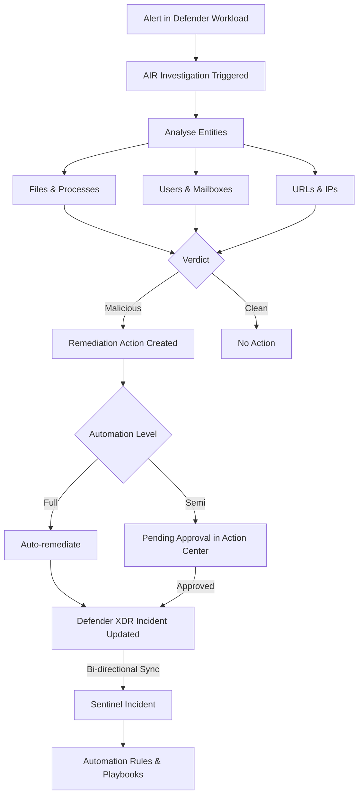

# SC-200 Implementation Guide

## Automated Investigation and Response (AIR) with Sentinel

### What
Automated Investigation and Response (AIR) is a capability in Microsoft Defender XDR that automatically investigates alerts, analyses entities, and takes remediation actions. When Sentinel is integrated with Defender XDR (unified security operations portal), AIR investigations feed directly into Sentinel incidents – combining automated triage with SIEM-level visibility.

### How AIR Works

1. An alert triggers in a Defender workload (MDE, MDO, MDI, MDA)
2. AIR launches an **automated investigation** that examines entities (files, processes, URLs, mailboxes, users)
3. Each entity receives a **verdict**: Malicious, Suspicious, Clean, or No threats found
4. AIR produces **remediation actions** (pending or auto-approved depending on the automation level)
5. The corresponding Sentinel incident is updated with AIR findings and evidence

### Steps – Enable the Integration

1. **Connect Defender XDR to Sentinel** – Sentinel → Content hub → Install "Microsoft Defender XDR" solution → Enable the data connector
2. **Enable incident sync** – On the connector page, enable bi-directional sync (incidents created in Defender XDR appear in Sentinel and vice versa)
3. **Configure automation levels** – In the Defender portal → Settings → Endpoints → Advanced features → Set the automation level per device group
4. **Review AIR results in Sentinel** – Incidents synced from Defender XDR include investigation tabs, evidence, and pending actions
5. **Build automation rules on AIR outcomes** – Use Sentinel automation rules to trigger playbooks based on incidents containing AIR evidence

### Automation Levels (Defender for Endpoint)

| Level | Behaviour | Use Case |
|-------|-----------|----------|
| **Full – remediate threats automatically** | AIR investigates and remediates without approval | Mature SOC, high confidence in detections |
| **Semi – require approval for core folders** | Auto-remediates except for actions on core OS folders | Balanced approach |
| **Semi – require approval for non-temp folders** | Auto-remediates only in temp folders | Conservative for file remediation |
| **Semi – require approval for any remediation** | All remediation actions require SOC approval | New deployments, cautious teams |
| **No automated response** | AIR still investigates but takes no action | Investigation-only mode |

### Architecture



### AIR Remediation Actions by Workload

| Workload | Example Actions |
|----------|----------------|
| **Defender for Endpoint** | Quarantine file, stop process, isolate device, collect investigation package, restrict app execution |
| **Defender for Office 365** | Soft-delete email, block URL, block sender, disable forwarding rule |
| **Defender for Identity** | Disable user in AD, force password reset, confirm user compromised |
| **Defender for Cloud Apps** | Suspend user, revoke OAuth app tokens, mark as compromised |

### Example – Sentinel Automation Rule Triggered by AIR

Use an automation rule to escalate incidents where AIR found malicious entities:

1. **Trigger** – When incident is created
2. **Condition** – Alert product name contains "Microsoft Defender for Endpoint" AND severity = High
3. **Actions**:
   - Assign to Tier 2 analyst
   - Change status to Active
   - Run playbook → Post to Teams SOC channel with incident details

### Example – Review Pending Actions

```
Defender portal → Action center → Pending tab
```
- Review the entity, recommended action, and investigation that triggered it
- **Approve** or **Reject** each action
- Bulk-approve actions for the same investigation

### Example KQL – Query AIR Investigation Data in Sentinel

```kql
SecurityIncident
| where ProviderName == "Microsoft 365 Defender"
| mv-expand AlertIds
| join kind=inner (SecurityAlert
    | where ProviderName == "MDATP"
    | extend AlertId = SystemAlertId
) on $left.AlertIds == $right.AlertId
| project TimeGenerated, IncidentNumber, Title, Severity, AlertName, Entities
| order by TimeGenerated desc
```

### Key Exam Points

- AIR is a **Defender XDR** capability – not native to Sentinel, but fully integrated via the connector
- AIR **always investigates** regardless of automation level; the level controls whether it **remediates** automatically
- **Action Center** (Defender portal) is where pending remediation actions are approved/rejected
- The **automation level** is set **per device group** in Defender for Endpoint
- **Full automation** is recommended by Microsoft for mature organisations
- Sentinel sees AIR results through **bi-directional incident sync** with Defender XDR
- AIR works across **MDE, MDO, MDI, and MDA** – each workload has its own remediation actions
- **Sentinel automation rules and playbooks** can act on AIR-generated incidents for further orchestration
- AIR investigations have a **time limit** – if not completed, the status shows as "Partially investigated"
- Remediation actions are **logged and auditable** in the Action Center history tab
- In the unified portal, you can see the **investigation graph** showing AIR's entity analysis alongside Sentinel data
- **Self-healing** – with full automation, common threats (malware, phishing) are resolved without SOC intervention
