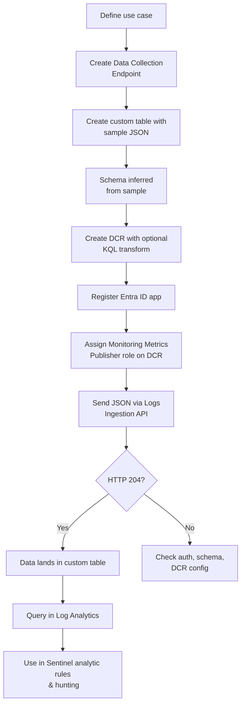

# SC-200 Implementation Guide

## Custom Tables with JSON in Log Analytics (DCR-Based Custom Logs)

### What
Custom tables let you ingest data from any source that isn't covered by a built-in connector. Using the **Logs Ingestion API** with a **Data Collection Rule (DCR)** and a **Data Collection Endpoint (DCE)**, you send JSON payloads into a custom table in the Log Analytics workspace – making the data available for Sentinel analytic rules, hunting, and workbooks.

### Use Cases

- **Third-party security appliance** that has no native Sentinel connector but can send JSON via webhook or API
- **Custom application logs** – your own apps push security-relevant events (auth failures, privilege changes)
- **Script-based collection** – PowerShell / Python scripts poll an external API and push results into Sentinel
- **IoT / OT device logs** – devices that export JSON over HTTP
- **Enrichment data** – push lookup/reference data into a custom table for KQL joins (alternative to watchlists for large datasets)

### Components Overview

| Component | Purpose |
|-----------|---------|
| **Custom table** (`_CL` suffix) | Destination table in Log Analytics that stores your data |
| **Data Collection Endpoint (DCE)** | HTTPS endpoint that receives the JSON payload |
| **Data Collection Rule (DCR)** | Defines the schema, optional KQL transform, and destination table |
| **Logs Ingestion API** | REST API you call to send JSON data |
| **Entra ID app registration** | Authentication – the sender needs a service principal with the **Monitoring Metrics Publisher** role |

### Steps – End-to-End Setup

#### 1. Create a Data Collection Endpoint (DCE)

1. **Navigate** – Azure portal → Monitor → Data Collection Endpoints → Create
2. **Basics** – Name, subscription, resource group, region (must match workspace region)
3. **Create** – Note the **Logs Ingestion URI** (e.g. `https://<dce-name>.<region>.ingest.monitor.azure.com`)

#### 2. Create the Custom Table and DCR

1. **Navigate** – Log Analytics workspace → Settings → Tables → Create → New custom log (DCR-based)
2. **Table name** – Enter a name (the `_CL` suffix is added automatically)
3. **Upload sample JSON** – Provide a sample JSON file representing your log records. This defines the schema:
   ```json
   [
     {
       "TimeGenerated": "2026-04-10T12:00:00Z",
       "SourceIP": "10.0.1.50",
       "DestinationIP": "203.0.113.10",
       "Action": "Blocked",
       "RuleName": "DenyOutbound",
       "Severity": "High",
       "Message": "Outbound connection blocked by firewall rule"
     }
   ]
   ```
4. **Review schema** – The portal parses the JSON and infers column names and data types. Adjust types if needed (string, int, datetime, dynamic, etc.)
5. **Data collection rule** – Create a new DCR or select an existing one
6. **Data collection endpoint** – Select the DCE created in step 1
7. **Transformation** – Optionally add a KQL transformation (runs on ingestion):
   ```kql
   source
   | where Severity != "Informational"
   | extend ParsedTime = todatetime(TimeGenerated)
   ```
8. **Review + Create** – The custom table and DCR are created together

#### 3. Set Up Authentication (Entra ID App Registration)

1. **Entra ID** → App registrations → New registration → Name it (e.g. "LogIngestion-App")
2. **Create a client secret** – Certificates & secrets → New client secret → Copy the value
3. **Assign RBAC role** – On the DCR resource, assign the **Monitoring Metrics Publisher** role to the app's service principal
4. **Note down:** Tenant ID, Client ID, Client Secret, DCR Immutable ID, DCE Logs Ingestion URI, Stream name (`Custom-<TableName>_CL`)

#### 4. Send JSON Data via the Logs Ingestion API

**Endpoint format:**
```
POST https://<DCE-URI>/dataCollectionRules/<DCR-Immutable-ID>/streams/Custom-<TableName>_CL?api-version=2023-01-01
```

**PowerShell example:**
```powershell
# Authenticate
$tenantId   = "<tenant-id>"
$clientId   = "<client-id>"
$secret     = "<client-secret>"
$scope      = "https://monitor.azure.com/.default"

$body = @{
    grant_type    = "client_credentials"
    client_id     = $clientId
    client_secret = $secret
    scope         = $scope
}
$token = (Invoke-RestMethod -Uri "https://login.microsoftonline.com/$tenantId/oauth2/v2.0/token" -Method POST -Body $body).access_token

# Send log data
$dceUri     = "https://<dce-name>.<region>.ingest.monitor.azure.com"
$dcrId      = "<dcr-immutable-id>"
$streamName = "Custom-FirewallEvents_CL"

$logData = @(
    @{
        TimeGenerated  = (Get-Date).ToUniversalTime().ToString("o")
        SourceIP       = "10.0.1.50"
        DestinationIP  = "203.0.113.10"
        Action         = "Blocked"
        RuleName       = "DenyOutbound"
        Severity       = "High"
        Message        = "Outbound connection blocked by firewall rule"
    }
) | ConvertTo-Json -AsArray

$headers = @{
    "Authorization" = "Bearer $token"
    "Content-Type"  = "application/json"
}

Invoke-RestMethod -Uri "$dceUri/dataCollectionRules/$dcrId/streams/$streamName`?api-version=2023-01-01" -Method POST -Headers $headers -Body $logData
```

**Python example:**
```python
import requests, json
from datetime import datetime, timezone

# Authenticate
tenant_id = "<tenant-id>"
client_id = "<client-id>"
secret = "<client-secret>"

token_url = f"https://login.microsoftonline.com/{tenant_id}/oauth2/v2.0/token"
token_resp = requests.post(token_url, data={
    "grant_type": "client_credentials",
    "client_id": client_id,
    "client_secret": secret,
    "scope": "https://monitor.azure.com/.default"
})
access_token = token_resp.json()["access_token"]

# Send log data
dce_uri = "https://<dce-name>.<region>.ingest.monitor.azure.com"
dcr_id = "<dcr-immutable-id>"
stream_name = "Custom-FirewallEvents_CL"

log_data = [
    {
        "TimeGenerated": datetime.now(timezone.utc).isoformat(),
        "SourceIP": "10.0.1.50",
        "DestinationIP": "203.0.113.10",
        "Action": "Blocked",
        "RuleName": "DenyOutbound",
        "Severity": "High",
        "Message": "Outbound connection blocked by firewall rule"
    }
]

resp = requests.post(
    f"{dce_uri}/dataCollectionRules/{dcr_id}/streams/{stream_name}?api-version=2023-01-01",
    headers={"Authorization": f"Bearer {access_token}", "Content-Type": "application/json"},
    data=json.dumps(log_data)
)
print(resp.status_code)  # 204 = success
```

### Flow



### Verify Data Ingestion

1. **Navigate** – Log Analytics workspace → Logs
2. **Query the custom table:**
   ```kql
   FirewallEvents_CL
   | take 10
   ```
3. **Check latency** – Data typically appears within 2–5 minutes after a successful API call
4. **Troubleshoot** – If no data appears:
   - Verify DCE region matches workspace region
   - Check DCR immutable ID and stream name
   - Confirm the app has the **Monitoring Metrics Publisher** role on the DCR
   - Check the JSON matches the defined schema (column names and types)

### Key Exam Points

- Custom tables always end with the **`_CL`** suffix
- The **Logs Ingestion API** is the modern replacement for the legacy HTTP Data Collector API (which created `_CL` tables without DCR control)
- A **Data Collection Endpoint (DCE)** is required – it provides the HTTPS ingestion URI
- A **Data Collection Rule (DCR)** defines the schema, transform, and destination
- The sender authenticates via **Entra ID app registration** with the **Monitoring Metrics Publisher** role on the DCR
- **TimeGenerated** column is required – if not provided, ingestion time is used
- Custom tables default to the **Analytics** plan (full KQL, Sentinel detections); can be switched to Basic for cost savings if not used in detections
- **KQL transforms** in the DCR can filter, rename, or enrich data before it's stored
- A **204 No Content** response means successful ingestion
- Custom tables are fully usable in **Sentinel analytic rules, hunting queries, and workbooks** (when on the Analytics plan)
