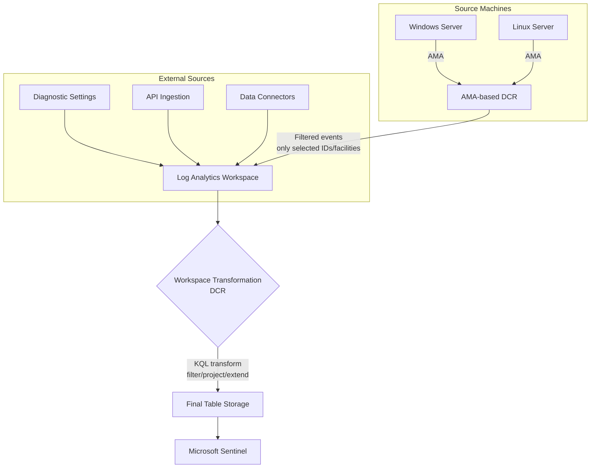

# SC-200 Implementation Guide

## Data Collection Rules – Filtering & Transforming Logs Before Ingestion

### What
Data Collection Rules (DCRs) define what data to collect, how to transform/filter it, and where to send it. They are the central configuration mechanism for Azure Monitor Agent (AMA) and workspace-level ingestion-time transformations, allowing you to reduce costs and noise by dropping or reshaping data **before** it is stored.

### Two Types of DCR Transformations

| Type | Scope | Use Case |
|------|-------|----------|
| **AMA-based DCR** | Specific machines running AMA | Filter Syslog facilities, Windows event IDs, perf counters at the agent level |
| **Workspace transformation DCR** | Entire Log Analytics workspace (any ingestion path) | Apply KQL transforms on data flowing into a table – works for all sources including API, diagnostic settings, and connectors |

### Steps – Create an AMA-Based DCR (Filter at Source)

1. **Navigate** – Azure Monitor → Data Collection Rules → Create
2. **Basics** – Name, subscription, resource group, region, platform type (Windows/Linux)
3. **Resources** – Add VMs or Arc-enabled servers that AMA should collect from
4. **Collect and deliver**:
   - **Add data source** – Choose source type (Windows Event Logs, Syslog, Performance Counters, Custom Text Logs, IIS Logs, etc.)
   - **Filter at source** – Select only the event IDs, facilities/severities, or counters you need
   - **Add destination** – Point to the Log Analytics workspace (and optionally Azure Monitor Metrics)
5. **Review + Create** – Deploy the DCR; AMA picks it up automatically

### Steps – Add a Workspace Transformation (KQL-Based)

1. **Navigate** – Log Analytics workspace → Tables
2. **Select table** – e.g. `Syslog`, `SecurityEvent`, `CommonSecurityLog`
3. **Create transformation** – Opens the DCR editor with a KQL query box
4. **Write the KQL transform** – The query runs on every incoming record; use `source` as the input stream
5. **Save** – The transformation applies to **all** data flowing into that table regardless of source

### Architecture



### Example – Filter Syslog to Auth Only (AMA DCR)

When creating the DCR data source for Syslog, select only:
- **Facility**: `auth`, `authpriv`
- **Minimum severity**: `Warning`

This drops all informational/debug syslog at the agent level – they never leave the machine.

### Example – Workspace Transformation: Drop Noisy Rows

```kql
source
| where SeverityLevel != "info"
```

Applied to the `Syslog` table, this drops all informational-severity records from **every** ingestion path before storage.

### Example – Workspace Transformation: Project Away Columns

```kql
source
| project-away SyslogMessage
```

Removes a high-cardinality column to reduce storage costs while keeping the rest of the record.

### Example – Workspace Transformation: Enrich and Filter

```kql
source
| where EventID in (4624, 4625, 4648, 4672)
| extend LogonResult = iff(EventID == 4625, "Failed", "Success")
```

Applied to `SecurityEvent`: keeps only logon-related events and adds a computed column.

### Example – Send to Multiple Destinations

A single DCR can send the **same** data source to multiple destinations:
- Full fidelity → primary Log Analytics workspace (Sentinel)
- Filtered subset → secondary workspace (long-term cheap storage)
- Metrics → Azure Monitor Metrics (for dashboards/autoscale)

### KQL Transform Rules & Limitations

- The input is always referenced as `source`
- Supported operators: `where`, `extend`, `project`, `project-away`, `project-rename`, `keep`, `drop`, `parse`, `summarize` (limited)
- **Not supported**: `join`, `union`, `mv-expand`, `externaldata`, cross-resource queries
- Output schema **must match** the target table schema (use `project` to ensure correct columns)
- Transformations run at ingestion time – they cannot be changed retroactively on stored data
- Max KQL statement length: **8,192 characters**

### Cost Impact

| Scenario | Ingestion Cost | Storage Cost |
|----------|---------------|--------------|
| No DCR filtering | 100% | 100% |
| AMA DCR – drop unneeded facilities/event IDs | Reduced (filtered at agent) | Reduced |
| Workspace transform – `where` filter | **Full** (data arrives first, then filtered) | Reduced |
| Workspace transform – `project-away` columns | **Full** | Reduced |
| Basic Logs tier + transformation | Reduced ingestion price tier | Reduced |

> **Key difference**: AMA-based filtering reduces **both** ingestion and storage costs because data never leaves the machine. Workspace transformations reduce **storage** costs but data still counts toward ingestion charges (with exceptions for certain filtering transforms that also reduce ingestion cost on supported tables).

### Key Exam Points

- **DCRs replaced the legacy agent configuration** – all AMA-based collection is governed by DCRs
- **Two layers of filtering**: agent-level (AMA DCR) and workspace-level (transformation DCR)
- **Agent-level filtering is cheaper** – data never leaves the source machine
- **Workspace transformations use KQL** with `source` as the input stream
- Workspace transformations apply to **all ingestion paths** for that table (not just AMA)
- You **cannot** use `join` or `union` in transformation KQL
- Output schema must match the destination table; use `project` to align columns
- **Custom log tables** (ending in `_CL`) fully support transformations
- A single DCR can route data to **multiple destinations** (multi-homing)
- Transformations are **not retroactive** – they only affect new incoming data
- **Basic Logs** tables can also have transformations applied for additional filtering
- DCRs are **Azure resources** – they can be managed via ARM/Bicep, CLI, Policy, and Terraform
