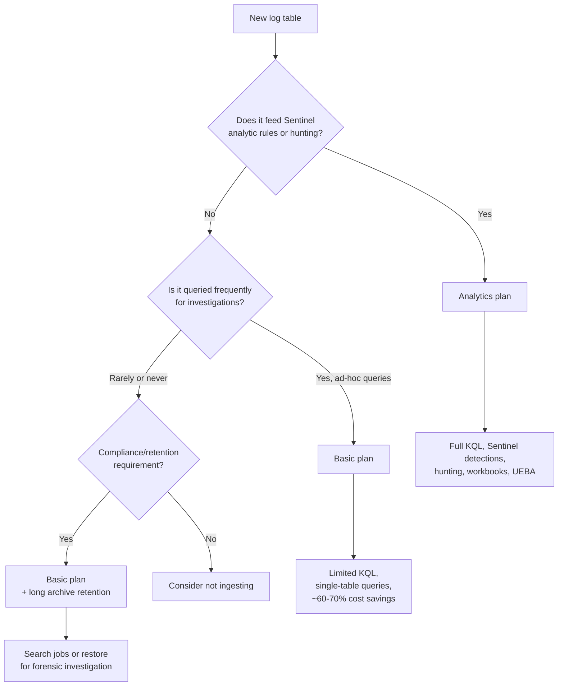
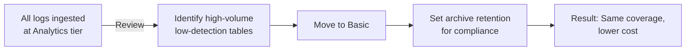

# SC-200 Implementation Guide

## Log Analytics Table Plans – Analytics, Basic & Archive

### What
Every table in a Log Analytics workspace has a **table plan** that determines query capabilities, retention, and cost. Choosing the right plan per table is critical for balancing security visibility with ingestion costs. The three plans are **Analytics**, **Basic**, and **Archive**.

### Table Plan Comparison

| Feature | Analytics | Basic | Archive |
|---------|-----------|-------|---------|
| **KQL support** | Full KQL (join, summarize, etc.) | Limited KQL (no join, no summarize across tables) | Must **restore** to query (creates temp Analytics table) |
| **Query scope** | Unlimited | Single table only | Search jobs or restore |
| **Analytic rules** | ✅ Supported | ❌ Cannot trigger detections | ❌ Cannot trigger detections |
| **Sentinel features** | ✅ Full (rules, hunting, workbooks, UEBA) | ❌ Not usable by Sentinel detections | ❌ Not usable |
| **Interactive retention** | 30 days – 2 years (default 90 days) | 30 days (fixed) | N/A – data is in cold storage |
| **Total retention** | Up to 12 years | Up to 12 years | Up to 12 years |
| **Ingestion cost** | Highest | ~60–70 % cheaper than Analytics | Cheapest (storage-only cost) |
| **Best for** | Security-critical logs needing detection & hunting | High-volume, low-value logs queried occasionally | Long-term compliance & forensic retention |

### When to Use Analytics Tables

Analytics is the **default and required plan** for any table that needs to:

- **Trigger analytic rules** – Scheduled, NRT, and Fusion rules only run against Analytics tables
- **Power Sentinel hunting queries** – Full KQL with joins across multiple tables
- **Feed UEBA** – User and entity enrichment requires Analytics data
- **Populate workbooks** – Complex visualisations need full KQL (summarize, render, join)
- **Support alert correlation** – Incidents correlate entities across Analytics tables

**Use Analytics for:** SecurityEvent, SigninLogs, AuditLogs, CommonSecurityLog, Syslog (if used in detections), OfficeActivity, ThreatIntelligenceIndicator, DeviceEvents, custom tables used in analytic rules.

### When to Use Basic Tables

Switch a table to Basic when:

- The data is **high-volume but low-security-value** (verbose trace logs, informational heartbeats)
- You need the data for **ad-hoc investigations** but not for automated detections
- You want to **reduce cost** significantly on tables that don't feed analytic rules

**Use Basic for:** ContainerLogV2, AppTraces, StorageBlobLogs, AzureMetrics (verbose), large custom log tables not used in detections.

### When to Use Archive

Archive moves data to cold storage after the interactive retention period:

- **Compliance** – Regulatory requirements to keep logs for years
- **Forensic investigations** – Restore old data to investigate historical incidents
- Data **cannot be queried directly** – must use a search job or restore

### Steps – Change a Table Plan to Basic

1. **Navigate** – Log Analytics workspace → Settings → Tables
2. **Find the table** – Search for the table name (e.g. `ContainerLogV2`)
3. **Select the table** → Click the context menu (…) → **Manage table**
4. **Change table plan** – Switch from Analytics to Basic
5. **Note:** Not all tables support Basic – some system tables are locked to Analytics

### Steps – Configure Archive Retention

1. **Navigate** – Log Analytics workspace → Settings → Tables → Select table → Manage table
2. **Set interactive retention** – How long data stays in hot storage (queryable directly)
3. **Set total retention** – Data beyond interactive retention moves to archive automatically
4. **Archive period** = Total retention − Interactive retention

### Steps – Query Archived Data

**Option 1 – Search Job (asynchronous)**:
1. Log Analytics → Run a search job query targeting the archived time range
2. Results are written to a new table (`_SRCH` suffix)
3. Query the results table when the job completes

**Option 2 – Restore (temporary Analytics table)**:
1. Log Analytics → Tables → Select table → Restore
2. Choose time range to restore
3. Data is available as a temporary Analytics table for up to 12 days
4. Full KQL is available on restored data

### Flow – Choosing the Right Table Plan

### Cost Optimisation Strategy

1. **Start with Analytics** for all tables
2. **Review usage** – Check which tables are queried by analytic rules (`SentinelHealth` table or rule audit)
3. **Identify candidates for Basic** – High-volume tables not referenced in any detection rule
4. **Set archive retention** – Extend total retention for compliance without paying Analytics rates
5. **Monitor** – Periodically review as new rules are created that may need tables back on Analytics

### Key Exam Points

- **Only Analytics tables** can be used by Sentinel analytic rules, hunting queries with joins, and UEBA
- **Basic tables** support limited KQL – no `join`, no cross-table queries, single-table only
- **Basic** is significantly cheaper – use for high-volume logs not needed for detections
- **Archive** is the cheapest tier but requires **restore or search job** to query (not interactive)
- Tables can be **switched from Analytics to Basic** (and back) in the table management settings
- **Not all tables** support Basic – some system/Sentinel tables are locked to Analytics
- **Interactive retention** = how long data is queryable; **total retention** = interactive + archive
- **Search jobs** write results to a `_SRCH` table; **restore** creates a temporary Analytics table
- The exam tests whether you know which plan to choose for a given scenario (high-volume verbose logs → Basic; detection-critical → Analytics)
