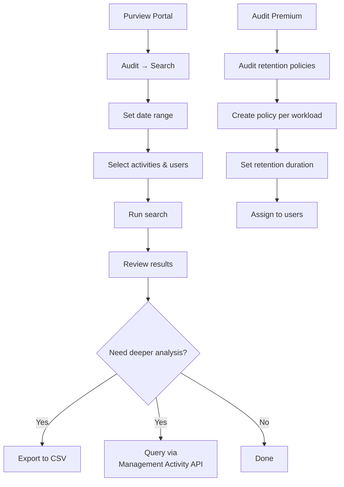

# SC-200 Implementation Guide

## Purview – Audit Log Search (Standard & Premium)

### What
Microsoft Purview Audit records user and admin activities across Microsoft 365 services. Audit (Standard) provides 180-day retention with thousands of audited events. Audit (Premium) extends retention, adds high-value events, and provides higher API bandwidth.

### Steps – Search the Audit Log

1. **Prerequisites:**
   - Audit logging is **enabled by default** in M365
   - Assign **View-Only Audit Logs** or **Audit Logs** role in Purview (both included in Compliance Administrator)
   - Mailbox auditing is on by default for all mailboxes
2. **Navigate** – Purview compliance portal → Audit → Search
3. **Set search criteria:**
   - **Date range** – Start and end date/time (max 90-day range per search)
   - **Activities** – Select specific activities or search all
   - **Users** – Filter by specific users (optional)
   - **File, folder, or site** – Filter by object name (optional)
   - **Workloads** – Exchange, SharePoint, Azure AD, Teams, Power BI, etc.
4. **Run the search** – Results appear in the Audit log search table
5. **Review results** – Click individual records for full detail (JSON payload)
6. **Export** – Export results to CSV for offline analysis

### Audit (Standard) vs Audit (Premium)

| Feature | Standard | Premium |
|---------|----------|---------|
| Default retention | 180 days | 1 year (configurable up to 10 years) |
| High-value events | ❌ | ✅ (MailItemsAccessed, Send, SearchQueryInitiated) |
| Audit log retention policies | ❌ | ✅ (custom retention per workload) |
| API bandwidth | Standard throttling | Higher throughput |
| Licence | E3 / E5 | E5 / E5 Compliance add-on |

### Steps – Configure Audit Retention Policies (Premium)

1. **Navigate** – Purview compliance portal → Audit → Audit retention policies
2. **Create policy:**
   - **Name** the policy
   - **Record type** – Select the workload/activity type (e.g. ExchangeItem, SharePointFileOperation)
   - **Duration** – Set retention period (90 days to 10 years)
   - **Priority** – Higher priority policies take precedence when multiple match
3. **Assign to users** – Apply to all users or specific users/groups

### Flow

### Key High-Value Audit Events (Premium)

| Event | What it captures |
|-------|-----------------|
| **MailItemsAccessed** | Every time a mail item is read (sync or bind) – critical for breach investigations |
| **Send** | Email sent by user – captures the message |
| **SearchQueryInitiatedExchange** | Search queries in Outlook (what the user searched for) |
| **SearchQueryInitiatedSharePoint** | Search queries in SharePoint/OneDrive |

### Key Exam Points

- Audit logging is **enabled by default** – no manual setup needed
- **Standard** retains logs for **180 days**; **Premium** up to **10 years**
- **MailItemsAccessed** is a Premium event – essential for determining if a compromised mailbox was actually accessed
- **Audit retention policies** (Premium) let you keep specific activity types longer than the default
- Audit log searches are limited to a **90-day window** per search
- Results are in **JSON format** – export to CSV for easier analysis
- **Mailbox auditing** is on by default since 2019 – no need to enable it
- The audit log is a **key investigation tool** used alongside Sentinel, Defender XDR, and eDiscovery
- Use the **Management Activity API** for programmatic access and SIEM integration
