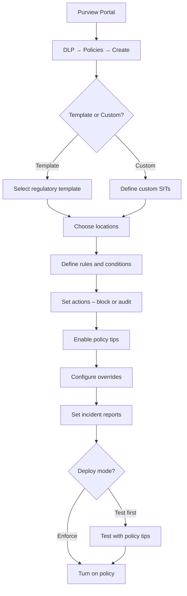

# SC-200 Implementation Guide

## Purview – Data Loss Prevention (DLP) Policies

### What
DLP policies detect and block sensitive data (credit card numbers, SSNs, health records, etc.) from being shared or exfiltrated across Exchange, SharePoint, OneDrive, Teams, and endpoints.

### Steps

1. **Navigate** – Purview compliance portal → Data loss prevention → Policies → Create policy
2. **Choose template or custom** – Select from regulatory templates (GDPR, HIPAA, PCI-DSS) or build a custom policy
3. **Name the policy** – Descriptive name and purpose
4. **Choose locations** – Select where the policy applies:
   - Exchange email
   - SharePoint sites
   - OneDrive accounts
   - Teams chat & channel messages
   - Devices (Endpoint DLP)
   - On-premises repositories
   - Power BI
5. **Define policy rules:**
   - **Condition** – Sensitive information types (SITs), sensitivity labels, or trainable classifiers
   - **Instance count** – Minimum number of matches to trigger (e.g. ≥ 5 credit card numbers)
   - **Confidence level** – High, medium, or low confidence match
6. **Set actions:**
   - Block sharing / sending
   - Encrypt email
   - Restrict access to content
   - Audit only (log but don't block)
7. **User notifications** – Enable policy tips (inform users they're about to violate policy)
8. **User overrides** – Optionally allow business justification to override the block
9. **Incident reports** – Configure who receives DLP incident alerts (email to compliance team)
10. **Test mode** – Deploy in "Test with policy tips" before enforcing
11. **Review + Create** – Activate the policy

### Flow

### Endpoint DLP – Additional Steps

1. **Onboard devices** – Devices must be onboarded to Microsoft Purview (same onboarding as MDE)
2. **Endpoint DLP settings** – Configure restricted apps, file path exclusions, browser restrictions
3. **Policy actions for endpoints** – Audit, block, or block with override for:
   - Copy to USB
   - Copy to network share
   - Upload to cloud service
   - Print
   - Copy to clipboard
   - Access by unallowed apps

### Key Exam Points

- DLP policies work across **multiple locations** (Exchange, SPO, OD, Teams, endpoints) in a single policy
- **Endpoint DLP** requires device onboarding (shared with MDE)
- **Policy tips** notify users in real-time before they violate a policy
- **Test mode** lets you evaluate policy impact without blocking anything
- **Sensitive Information Types (SITs)** are the core detection mechanism – built-in or custom
- DLP incident reports go to the **DLP Alerts** dashboard in Purview
- **User overrides** require a business justification and are logged for audit
- DLP policies can reference **sensitivity labels** as a condition (e.g. block sharing of "Confidential" labelled docs)
