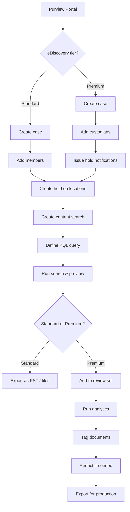

# SC-200 Implementation Guide

## Purview – eDiscovery

### What
eDiscovery enables searching, holding, and exporting content across Microsoft 365 for legal investigations, compliance audits, and internal reviews. Comes in two tiers: eDiscovery (Standard) and eDiscovery (Premium).

### Steps – eDiscovery (Standard)

1. **Prerequisites:**
   - Assign **eDiscovery Manager** or **eDiscovery Administrator** role
   - eDiscovery Manager can only see their own cases; Administrator can see all cases
2. **Navigate** – Purview compliance portal → eDiscovery → Standard
3. **Create a case:**
   - Give it a name and description
   - Optionally add members who can access the case
4. **Create a hold:**
   - Select locations to hold (Exchange mailboxes, SharePoint/OneDrive sites)
   - Optionally set a **query-based hold** – only hold items matching specific keywords or conditions
   - Hold preserves content from deletion or modification
5. **Create a search:**
   - Select content locations (mailboxes, sites, Teams, public folders)
   - Define **search query** – keywords, date range, sender/recipient, file types
   - Use **KQL-style syntax** for conditions
   - Run the search and preview results
6. **Export results:**
   - Select search → Export
   - Choose export format (PST for email, original files for documents)
   - Download via eDiscovery Export Tool

### Steps – eDiscovery (Premium)

1. **All Standard capabilities** plus:
2. **Custodian management:**
   - Add custodians (people of interest) to the case
   - Automatically map custodians to their mailboxes, OneDrive, Teams
   - Issue **legal hold notifications** (hold notices with acknowledgement tracking)
3. **Review sets:**
   - Add search results to a **review set** for detailed analysis
   - **Analytics** – near-duplicate detection, email threading, themes
   - **Tagging** – mark documents as Responsive, Privileged, Not Responsive
   - **Redaction** – redact sensitive text before production
4. **Conversation reconstruction** – Reconstruct full Teams/Yammer conversations
5. **Export for production** – Export review set with load files for legal tools

### Flow

### Key Exam Points

- **eDiscovery Manager** can only access their own cases; **eDiscovery Administrator** can access all cases
- **Holds** preserve content in-place – users don't know content is on hold (silent)
- **Query-based holds** only preserve items matching specific criteria (reduces scope)
- **eDiscovery (Premium)** adds custodian management, review sets, analytics, and hold notifications
- **Review set analytics** include near-duplicate detection, email threading, and theme grouping
- Premium requires **E5** or **E5 Compliance** add-on licence
- **Content search** without a case is also possible for quick one-off searches
- eDiscovery searches cover **Exchange, SharePoint, OneDrive, Teams, and public folders**
- **Legal hold notification** (Premium only) tracks whether custodians have acknowledged the hold
