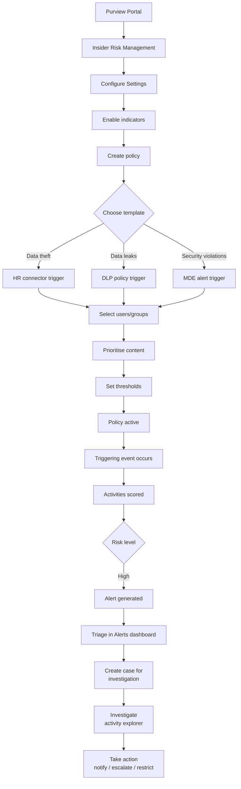

# SC-200 Implementation Guide

## Purview – Insider Risk Management

### What
Insider Risk Management detects and investigates risky user activities that could lead to data theft, data leaks, or security policy violations. It correlates signals from Microsoft 365, Defender for Endpoint, and HR connectors to identify patterns of concern.

### Steps – Enable and Configure

1. **Prerequisites:**
   - Assign **Insider Risk Management** or **Insider Risk Management Admin** role to admins
   - Audit logging must be enabled (enabled by default in M365)
   - Optional: HR connector for termination/resignation signals
   - Optional: MDE onboarding for endpoint activity signals
2. **Navigate** – Purview compliance portal → Insider risk management → Settings
3. **Configure settings:**
   - **Privacy** – Show anonymised or actual usernames in alerts
   - **Policy indicators** – Enable signal categories:
     - Office indicators (download, print, copy to USB, email to external)
     - Device indicators (requires MDE – file copy, cloud upload)
     - Security policy violation indicators
     - HR indicators (resignation, termination via HR connector)
   - **Policy timeframes** – Activation window (how far back to look after trigger)
   - **Intelligent detections** – Exclude specific file types, domains, or sensitive info types
   - **Priority user groups** – Users to monitor with lower thresholds (e.g. departing employees)

### Steps – Create a Policy

1. **Navigate** – Insider risk management → Policies → Create policy
2. **Choose template:**
   - **Data theft by departing users** – Triggered by HR connector resignation/termination date
   - **General data leaks** – Triggered by DLP policy match
   - **Data leaks by priority users** – Applies to specific user groups
   - **Security policy violations** – Triggered by MDE alerts
   - **Data leaks by disgruntled users** – Triggered by HR performance indicators
3. **Name and describe** the policy
4. **Select users or groups** – All users, specific groups, or priority user groups
5. **Content to prioritise** – Optionally focus on SharePoint sites, sensitivity labels, or SITs
6. **Select triggering event** – What activates the policy (DLP match, HR signal, MDE alert)
7. **Select indicators** – Which activities to score once the policy is triggered
8. **Set thresholds** – Use Microsoft defaults or customise alert levels
9. **Review + Create** – Activate the policy

### Flow

### Investigation Workflow

1. **Alerts dashboard** – Review triggered alerts with risk scores
2. **Triage** – Confirm, dismiss, or needs investigation
3. **Create case** – Escalate alert to a full case
4. **Activity explorer** – Timeline of all user activities within the case (files accessed, emails sent, USB copies)
5. **Content explorer** – View the actual files/emails involved
6. **Take action:**
   - Send notification to user
   - Escalate to eDiscovery (Premium) case
   - Restrict user access

### Key Exam Points

- **Triggering events** activate the policy (HR signal, DLP match, MDE alert) – without a trigger, activities are not scored
- Policies use **templates** – you don't build detection logic from scratch
- **HR connector** is needed for departing-user scenarios (provides resignation/termination dates)
- **Anonymisation** hides usernames during investigation to reduce bias (configurable)
- **Priority user groups** lower the threshold for alert generation
- Insider risk integrates with **eDiscovery (Premium)** for legal escalation
- **Activity explorer** shows the detailed user activity timeline within a case
- Insider risk is **not real-time blocking** – it detects and alerts; DLP handles blocking
