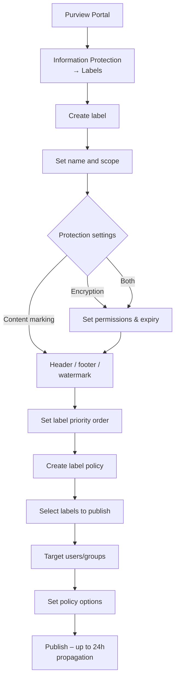

# SC-200 Implementation Guide

## Purview – Sensitivity Labels

### What
Sensitivity labels classify and protect documents and emails by applying encryption, content markings (headers, footers, watermarks), and access restrictions. Labels persist with the content wherever it travels.

### Steps – Create and Publish Labels

1. **Navigate** – Purview compliance portal → Information protection → Labels → Create a label
2. **Name and description** – Internal name + user-facing tooltip
3. **Scope** – Choose where the label applies:
   - Files & emails
   - Groups & sites (container-level protection)
   - Schematized data assets
4. **Protection settings:**
   - **Encryption** – Control who can access content and what they can do (view, edit, print)
     - User-assigned permissions (let users choose) or admin-defined permissions
     - Offline access and expiration settings
   - **Content marking** – Add header, footer, or watermark text
   - **Auto-labelling** – Automatically apply label when sensitive info is detected (optional at creation)
5. **Sub-labels** – Create hierarchy (e.g. Confidential → Confidential\All Employees, Confidential\Finance Only)
6. **Label priority** – Higher-ordered labels are higher sensitivity; users can upgrade but need justification to downgrade
7. **Publish labels via label policy:**
   - Information protection → Label policies → Publish labels
   - **Select labels** to publish
   - **Target users/groups** – All users or specific groups
   - **Policy settings:**
     - Require justification to remove or downgrade a label
     - Require users to apply a label (mandatory labelling)
     - Default label for documents, emails, meetings
     - Link to custom help page
8. **Wait for propagation** – Policies can take up to 24 hours to reach all users

### Flow

### Auto-Labelling Policies

1. **Navigate** – Information protection → Auto-labelling → Create policy
2. **Choose SITs** – Select sensitive information types to detect (e.g. credit card, passport number)
3. **Choose locations** – Exchange, SharePoint, OneDrive
4. **Select label** – Label to apply when conditions match
5. **Simulation mode** – Run in simulation first to review matches before enforcing
6. **Turn on policy** – Enable after reviewing simulation results

### Key Exam Points

- **Encryption in a label** restricts access even if the file is copied outside the organisation
- **Content markings** are visual only – they don't prevent access
- **Label policies** publish labels to users; labels don't appear until published
- **Mandatory labelling** forces users to classify all new docs/emails
- **Downgrade justification** is logged in the audit log
- **Auto-labelling** can be client-side (built into label definition) or service-side (auto-labelling policy)
- **Client-side auto-labelling** recommends or auto-applies in Office apps; **service-side** applies to content at rest in SPO/OD/Exchange
- **Priority order** matters – higher priority = higher sensitivity; lower labels can't override higher ones without justification
- Labels for **groups & sites** control privacy, external sharing, and unmanaged device access at the container level (no file encryption)
