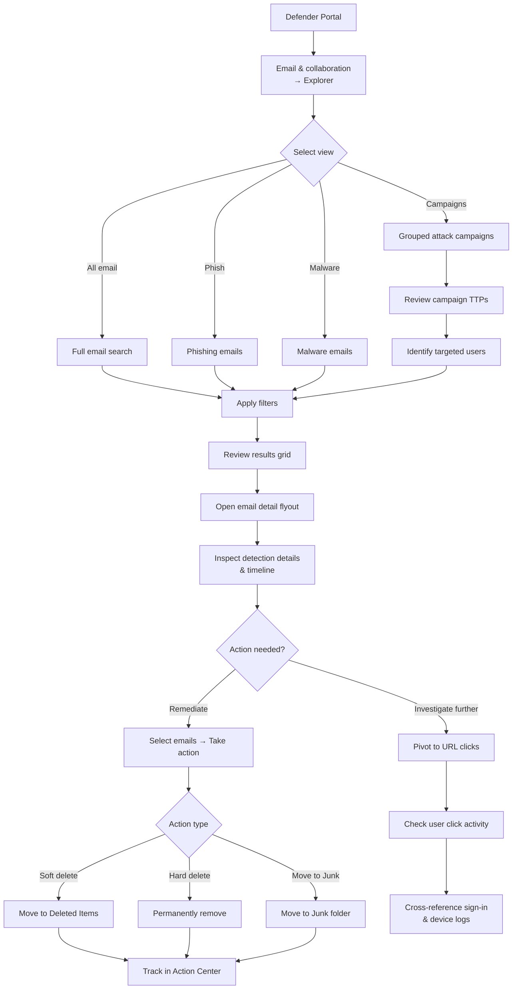

# SC-200 Implementation Guide

## MDO – Threat Explorer (Detailed Investigation)

### What
Threat Explorer is a real-time investigation tool in Microsoft Defender for Office 365 (Plan 2) that lets security analysts search, analyse, and remediate email-based threats – phishing, malware, and business email compromise. It provides the deepest level of email threat visibility in the Defender portal.

### Prerequisites

- **Microsoft Defender for Office 365 Plan 2** (or E5 licence)
- Assign **Security Reader** (view-only) or **Security Administrator** / **Search and Purge** role (to take remediation actions)

### Steps – Investigate Email Threats

1. **Navigate** – Defender portal → Email & collaboration → Explorer
2. **Select a view:**
   - **All email** – Every inbound/outbound email
   - **Malware** – Emails with malware detections
   - **Phish** – Emails identified as phishing
   - **Campaigns** – Grouped attack campaigns targeting the org
   - **Content malware** – Malware detected in SharePoint, OneDrive, Teams files
3. **Set filters to narrow results:**
   - Sender / sender domain
   - Recipient
   - Subject
   - Date range (up to 30 days)
   - Delivery action (Delivered, Blocked, Replaced, Junked)
   - Detection technology (URL detonation, file detonation, anti-spoof, impersonation, etc.)
   - Original / latest delivery location
   - Directionality (Inbound, Outbound, Intra-org)
4. **Review the results grid** – Each row is an email with summary columns
5. **Click an email** to open the detail flyout:
   - **Email summary** – Sender, recipient, subject, delivery action
   - **Detection details** – Which protection layer caught the threat and why
   - **URLs** – All URLs in the email with click & detonation verdicts
   - **Attachments** – File details and detonation results
   - **Email timeline** – Full delivery lifecycle (received → filtered → delivered/blocked → ZAP)
   - **Similar emails** – Quickly pivot to find other emails from the same campaign

### Steps – Remediate Emails

1. **Select one or more emails** in the results grid
2. **Click "Take action"** (requires Search and Purge role):
   - **Soft delete** – Move to Deleted Items (recoverable by user)
   - **Hard delete** – Permanently remove from mailbox
   - **Move to Junk** – Move to Junk Email folder
   - **Move to Inbox** – Restore false positives
3. **Approve remediation** – Actions are submitted and tracked in the Action Center
4. **Track in Action Center** – Email & collaboration → Action center → Review pending/completed actions

### Steps – Investigate URL Clicks

1. **Explorer → URL clicks tab** – View all URL click events
2. **Filter by:**
   - URL / URL domain
   - Clicked by (user)
   - Click verdict (Allowed, Blocked by Safe Links, Pending)
3. **Identify users who clicked malicious links** – Determine if credentials were compromised
4. **Pivot** – Cross-reference with sign-in logs and MDE device activity

### Steps – Investigate Campaigns

1. **Explorer → Campaigns view** – Aggregated attack campaigns
2. **Review campaign details:**
   - Sender infrastructure (IPs, sending domains)
   - TTPs used (impersonation, URL obfuscation, attachment type)
   - Number of targeted / compromised users
   - Timeline of the campaign
3. **Pivot to individual emails** within the campaign for remediation

### Flow

### Threat Explorer vs Real-Time Detections

| Feature | Threat Explorer | Real-Time Detections |
|---------|----------------|---------------------|
| Licence | Defender for Office 365 **Plan 2** | Defender for Office 365 **Plan 1** |
| Data range | **30 days** | **10 days** |
| Remediation actions | ✅ Soft/hard delete, move | ❌ View only |
| Campaign view | ✅ | ❌ |
| Email timeline | ✅ | ❌ |
| URL click investigation | ✅ Full | Limited |

### Key Exam Points

- **Threat Explorer** requires MDO **Plan 2** (or E5); Plan 1 only gets **Real-Time Detections** (limited)
- **Search and Purge** role is required to take remediation actions (soft/hard delete); Security Reader can only view
- **ZAP (Zero-hour Auto Purge)** actions are visible in the email timeline – shows if a delivered email was later removed
- Threat Explorer retains data for **30 days**; Real-Time Detections only 10 days
- **Campaigns view** groups related attack emails by shared infrastructure and TTPs
- **URL click data** shows which users clicked through Safe Links – critical for post-phish investigation
- Remediation actions are **tracked in the Action Center** and can require approval
- Use the **email timeline** to understand the full delivery lifecycle and see which protection layer acted
- Threat Explorer is a key tool for **post-breach email investigation** – commonly tested in SC-200
